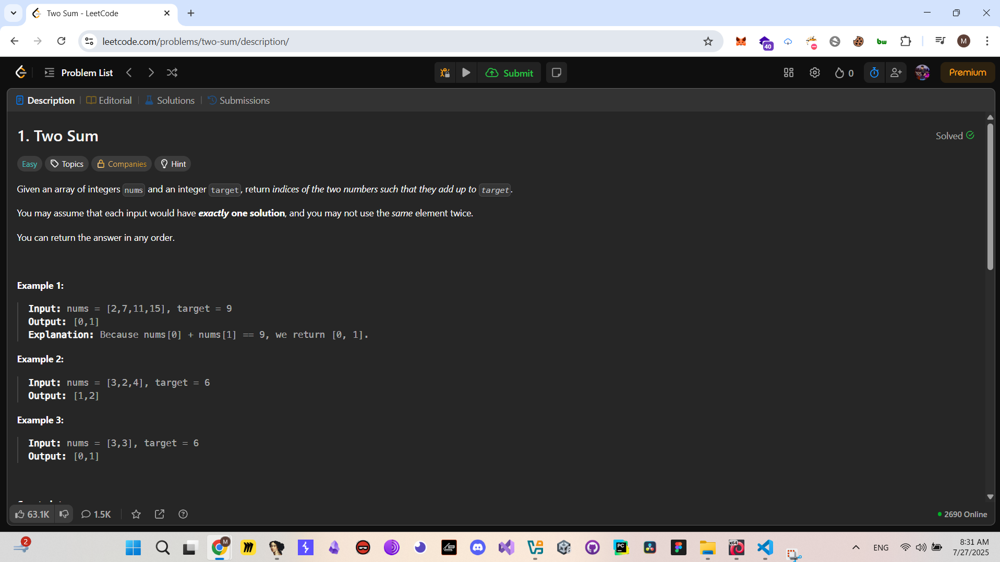
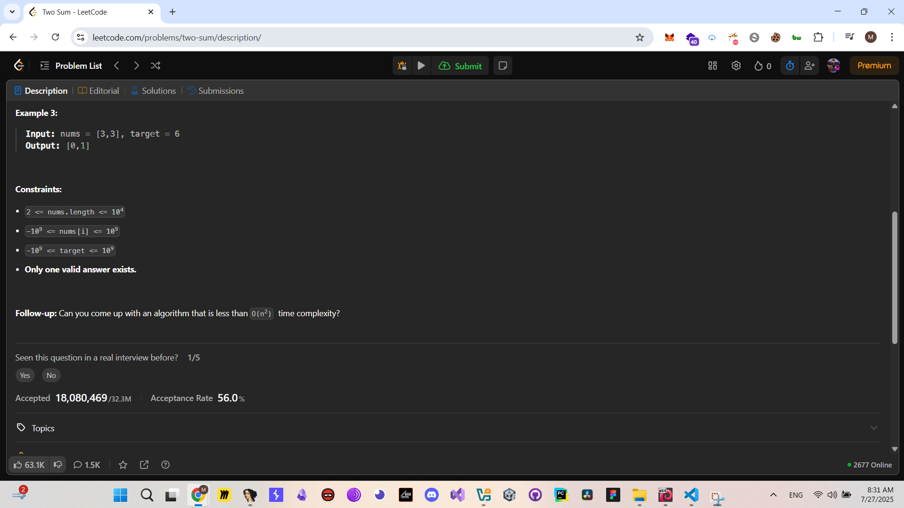

# Two Sum - Writeup

## Description






## Solution

this Problem is pretty straightforward ,, we have an array and we should build an other array with size equal 2 that has the indexes of the two integers which their sum is the given target integer.
for this challenge i liked the C solution,, i appeared mindblowing for me.

## C Solution (Two Sum Using Sort and Two Pointer Approach (Without Hash Map))

```c
/**
 * Note: The returned array must be malloced, assume caller calls free().
 */
int compare(const void *a, const void *b)
{
    return (*(int (*)[2])a)[0] - (*(int (*)[2])b)[0];
}

int *twoSum(int *nums, int numsSize, int target, int *returnSize)
{
    int newNums[numsSize][2];
    for (int i = 0; i < numsSize; i++)
    {
        newNums[i][0] = nums[i];
        newNums[i][1] = i;
    }
    qsort(newNums, numsSize, sizeof(newNums[0]), compare);

    int left = 0, right = numsSize - 1;

    int *arr = malloc(2 * sizeof(int));
    *returnSize = 2;

    while (left < right)
    {
        if (newNums[left][0] + newNums[right][0] == target)
        {
            arr[0] = newNums[left][1];
            arr[1] = newNums[right][1];
            return arr;
        }
        else if (newNums[left][0] + newNums[right][0] > target)
        {
            right--;
        }
        else
        {
            left++;
        }
    }
    return arr;
}
```

## Cpp Solution (Bruteforce)

```Cpp
class Solution
{
public:
    vector<int> twoSum(vector<int> &nums, int target)
    {
        for (int i = 0; i < nums.size(); i++)
        {
            for (int j = i + 1; j < nums.size(); j++)
            {
                if (nums[i] + nums[j] == target)
                {
                    return {i, j};
                }
            }
        }
        return {};
    }
};
```

## Python Solution (Bruteforce)

```python
class Solution:
    def twoSum(self, nums: List[int], target: int) -> List[int]:
        n = len(nums)
        for i in range(n - 1):
            for j in range(i + 1, n):
                if nums[i] + nums[j] == target:
                    return [i, j]
        return []  # No solution found
```

## Java Solution (Bruteforce)

```java
class Solution {
    public int[] twoSum(int[] nums, int target) {
        int n = nums.length;
        for (int i = 0; i < n - 1; i++) {
            for (int j = i + 1; j < n; j++) {
                if (nums[i] + nums[j] == target) {
                    return new int[]{i, j};
                }
            }
        }
        return new int[]{}; // No solution found
    }
}
```
